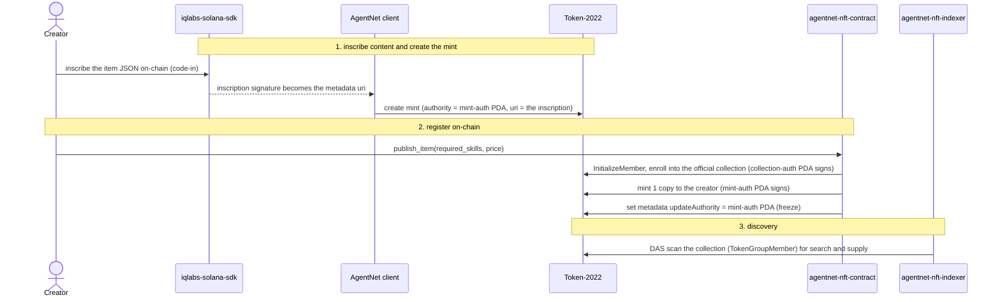
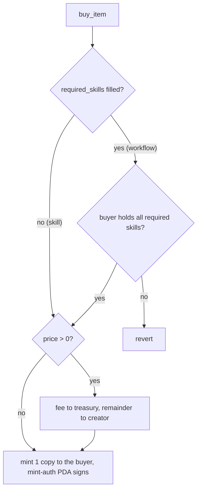

# agentnet-nft-contract

On-chain gate for AgentNet **item** NFTs. An item is a standard Token-2022 soulbound mint;
this Anchor program adds the one thing the standard cannot express on a mint: a
**conditional mint**. Every item mint's authority is a PDA only this program can sign for,
so the only way to get a token is `buy_item`.

One model covers two kinds of item:

- **Skill** - `required_skills` is empty. Anyone can buy it.
- **Workflow** - `required_skills` is filled. A buyer must already hold every listed skill.

The prerequisite loop simply runs zero times for a skill.

## Where this sits

An AgentNet item is created and read across a few pieces; this program is the on-chain gate.

- **[iqlabs-solana-sdk](https://github.com/IQCoreTeam/iqlabs-solana-sdk)** (`@iqlabs-official/solana-sdk`) inscribes the item's content (the skill / workflow JSON) on-chain via **code-in**; the inscription signature becomes the Token-2022 metadata `uri`.
- The **AgentNet client** (`createSkillMint`) creates the Token-2022 soulbound mint, hands its authority to this program's `mint-auth` PDA, and points its metadata `uri` at the code-in inscription.
- **agentnet-nft-contract** (this repo) registers the mint into the official collection and freezes it (`publish_item`), and is the only mint path for buyers (`buy_item`).
- **agentnet-nft-indexer** DAS-scans the official collections (each mint's `TokenGroupMember`) to power marketplace search, trait filtering, and supply ranking.

## How a mint is registered into a collection

To publish an item, the client first creates the Token-2022 mint with its authority set to
this program's per-item `mint-auth` PDA, then calls `publish_item`. The program enrolls the
mint into the official TokenGroup (skills or workflows), mints the first copy to the creator,
and freezes the item's metadata. Collection membership is what the indexer scans and what the
on-chain prerequisite check reads.



- A **skill** enrolls into `OFFICIAL_SKILLS_COLLECTION`; a **workflow** into
  `OFFICIAL_WORKFLOWS_COLLECTION`. `publish_item` requires `group` to be one of the two.
- For a workflow, each `required_skill` is validated here, once: it must be a real Token-2022
  mint already a member of the skills collection, with no duplicates.
- The freeze step is what makes a published item immutable: its update authority moves to the
  `mint-auth` PDA and no instruction signs that PDA for an edit, so nobody (not the creator,
  not a custom client) can change a published item's contents after it is registered.

## Buying

`buy_item` is the only path to a token. For a **workflow** it verifies on-chain that the
buyer holds every required skill; for a **skill** that check is a no-op. If the item is
priced, the protocol fee comes out of the price and the remainder goes to the creator.



Membership is checked in O(1): a skill mint carries its own `TokenGroupMember.group`, which
the program reads and compares to the official collection. It never enumerates the
collection, so cost does not grow with the catalog.

## PDAs (seeds)

| PDA | Seeds | Role |
| --- | --- | --- |
| Item config | `["item", item_mint]` | stores creator, price, required_skills |
| Mint authority | `["mint-auth", item_mint]` | per item; only the program can mint copies, and it holds the frozen metadata authority |
| Collection authority | `["collection-auth"]` | global; the update authority of both official groups, signs member enrollment |

## Mainnet

| | address |
| --- | --- |
| Program | `8YmcHuCx323RtqC8mzTJ5CH4oVT8mPKJ7xarcPKbdgof` (upgradeable) |
| Skills collection | `BUGHnCh2Pf93tgcxAEfhjd6tUjbY56JrSZdCRXyt7uS5` |
| Workflows collection | `6vmWMRWUD34LEjA8eGefegKe5E38WufveMAe2pTm61i8` |
| Fee treasury | `EWNSTD8tikwqHMcRNuuNbZrnYJUiJdKq9UXLXSEU4wZ1` (690 bps = 6.9%, out of price) |

These live in `lib.rs` (`declare_id!`) and `constants.rs`. Build with `--features devnet` to
target the devnet collections instead.

## Build and deploy

```bash
anchor build                       # mainnet (default features)
anchor build -- --features devnet  # devnet collections

# upgrade the deployed program (uses the upgrade authority, not a program keypair)
solana program deploy \
  --program-id 8YmcHuCx323RtqC8mzTJ5CH4oVT8mPKJ7xarcPKbdgof \
  --url mainnet-beta \
  target/deploy/agent_workflow_nft.so
```

Built with Anchor 0.32.1, rustc 1.89.0 (pinned in `rust-toolchain.toml`).

## Versioning (issue #166)

A published item is immutable by construction (the freeze above). An opt-in update path,
where a creator publishes a new version and each holder adopts it explicitly rather than
having what they already hold changed under them, is to be discussed and added in a later
upgrade.
